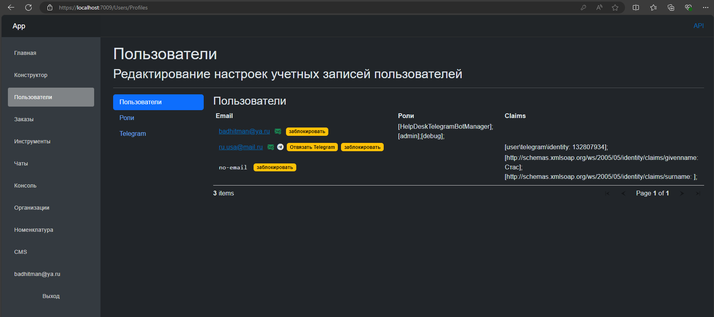
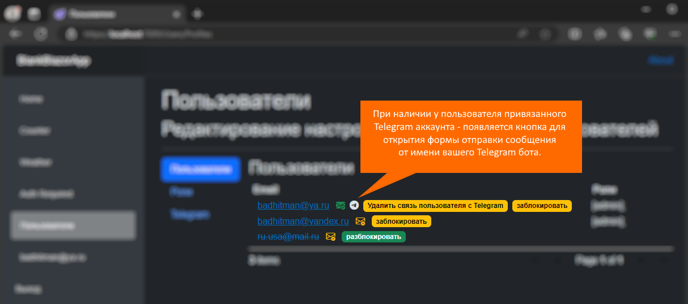
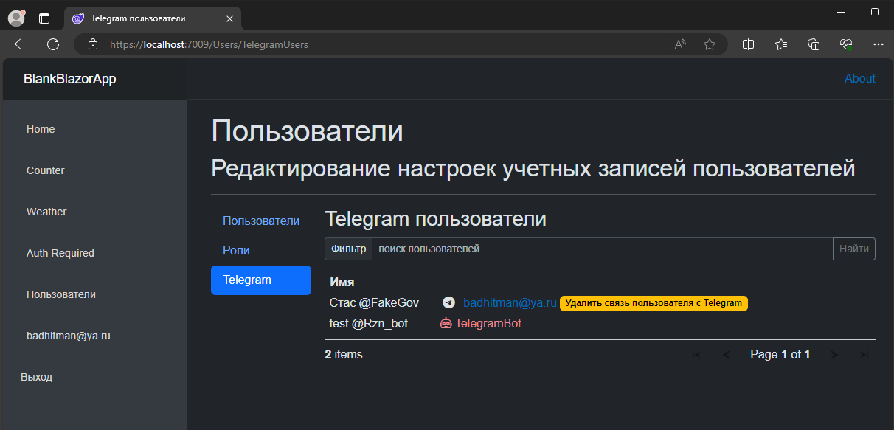
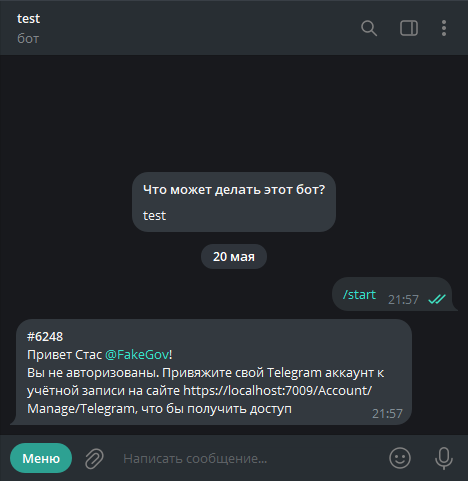
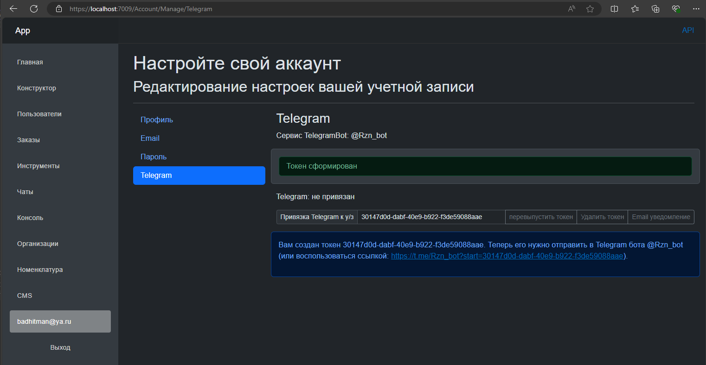
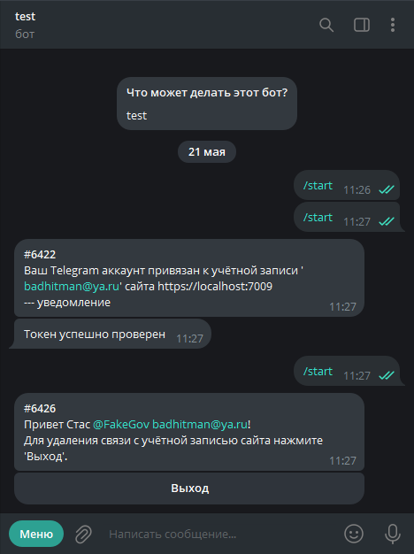

## Blazor WebApp служба

### Пользователи

Добавлен минимальный набор инструментов управления ролями пользователей



можно отправить сообщение пользователю



клиенты Telegram



#### Привязка и отключение Telegram с учётной записью сайта
В `ApplicationUser : IdentityUser` есть свойство:
```c#
/// <summary>
/// Telegram Id
/// </summary>
public long? TelegramId { get; set; }
```
это значение указывает на связь с аккаунтом Telegram. Информацию по самим пользователям Telegram можно получить из контекста `MainAppContext`. В таблице `TelegramUsers`
```c#
/// <summary>
/// Telegram пользователи
/// </summary>
public DbSet<TelegramUserModelDb> TelegramUsers { get; set; }
```
по свойству:
```c#
/// <summary>
/// Уникальный идентификатор Telegram пользователя (или бота)
/// </summary>
public long TelegramId { get; set; }
```
можно получить данные, которые проверяются/кэшируются в БД при каждом входящем запросе в TelegramBot.

Постороннему пользователю в данном случае отвечает простым приветсвием: как это реализовано в базовом `DefaultTelegramDialogHandle: ITelegramDialogService`



Управление привязкой Telegram аккаунта к своей учётной записи возможно из личного раздела `/Account/Manage/Telegram`. Пользователь может создать временную одноразовую ссылку/код для подтверждения связи через свой же TelegramBot. Кнопка "Создать токен":


Создать новый токен можно и после привязки Telegram к у/з, но каждое новое подтверждение Telegram аккаунта перезаписывает прежнюю связь. Подключение одновременно нескольких Telegram аккаунтов не поддерживается.
Созданный токен можно использовать как ссылку напрямую в Telegram боте


, а можно отправить боту токен (guid) как текст.



Если токен существует и не просрочился, то устанавливается связь между Telegram аккаунтом и учётной записью на сайте:



#### Синхронизация настроек между службами BlazorWebApp и TelegramBotService.
При каждом запуске каждой из служб происходит попытка синхронизации настроек `WebConfigModel`. В `BlazorWebApp` они существуют как типовая опция IOptions<WebConfigModel>
```c#
builder.Services.Configure<WebConfigModel>(builder.Configuration.GetSection("WebConfig"));
```
, а в службе `TelegramBotService` этот объект существует в виде Singleton объекта
```c#
services.AddSingleton<WebConfigModel>();
```

Дело в том, что сама `TelegramBotService` не конфигурирует эти параметры, а запрашивает их при старте от `BlazorWebApp`. В свою очередь `BlazorWebApp` при запуске отправляет эти конфиги в сторону `TelegramBotService`. В конечном итоге обеспечивается своевременная актуализация этих настроек, которые конфигурируются в одном месте на стороне `BlazorWebApp` службы, а вторая служба их получает так или иначе. В этих настройках в частности передаётся адрес сайта Web части и срок действия токена привязки Telegram аккаунта к учётной записи сайта.