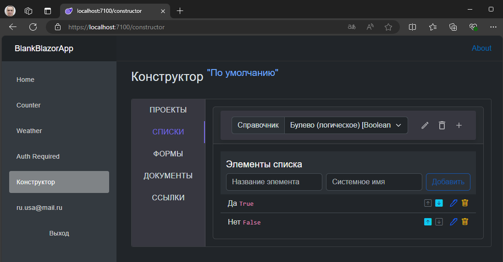
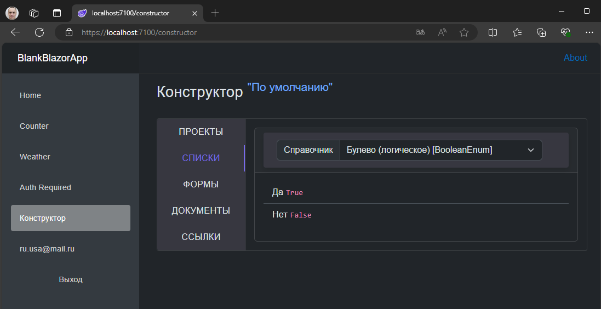
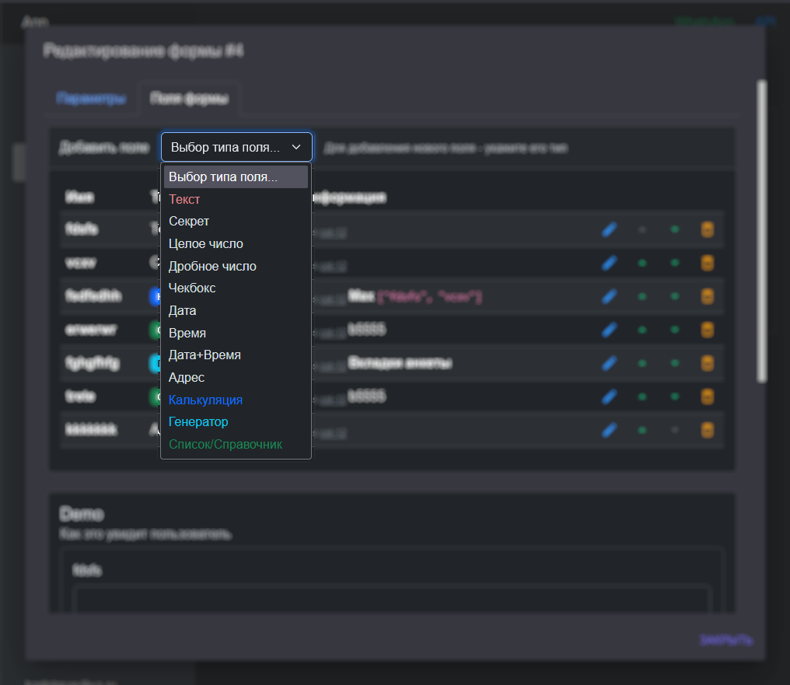
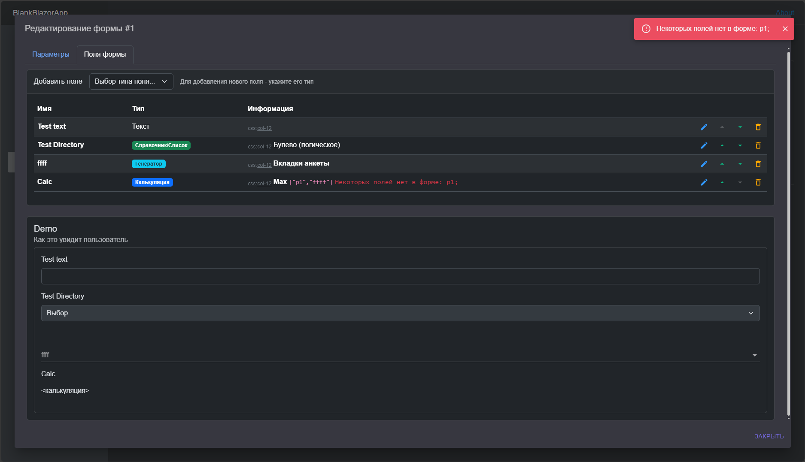
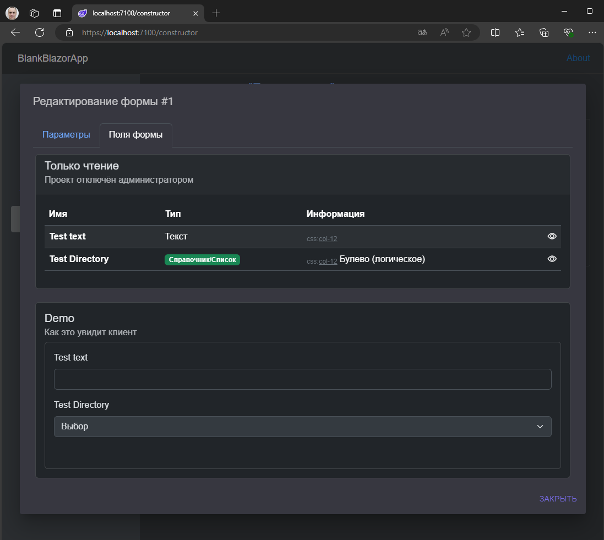
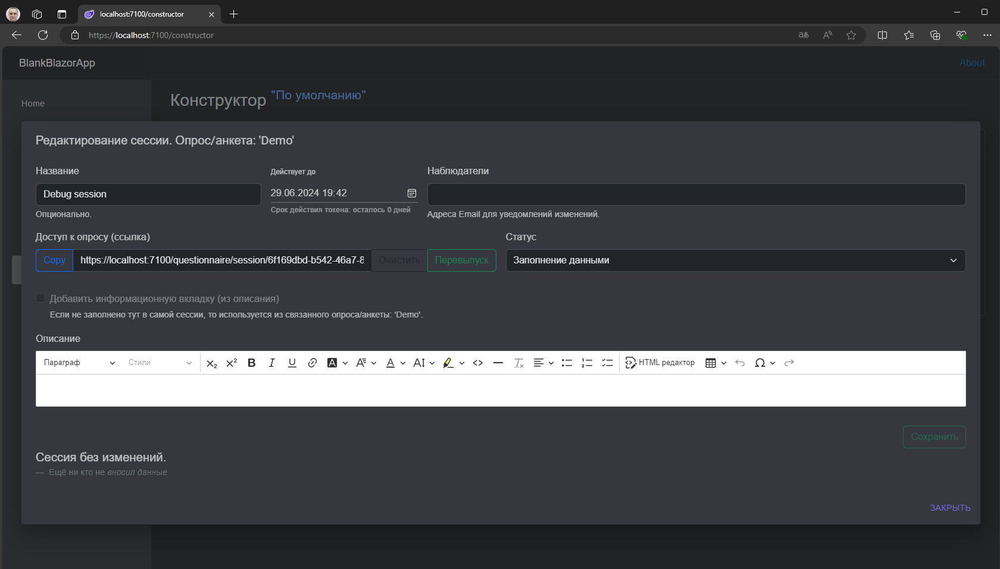
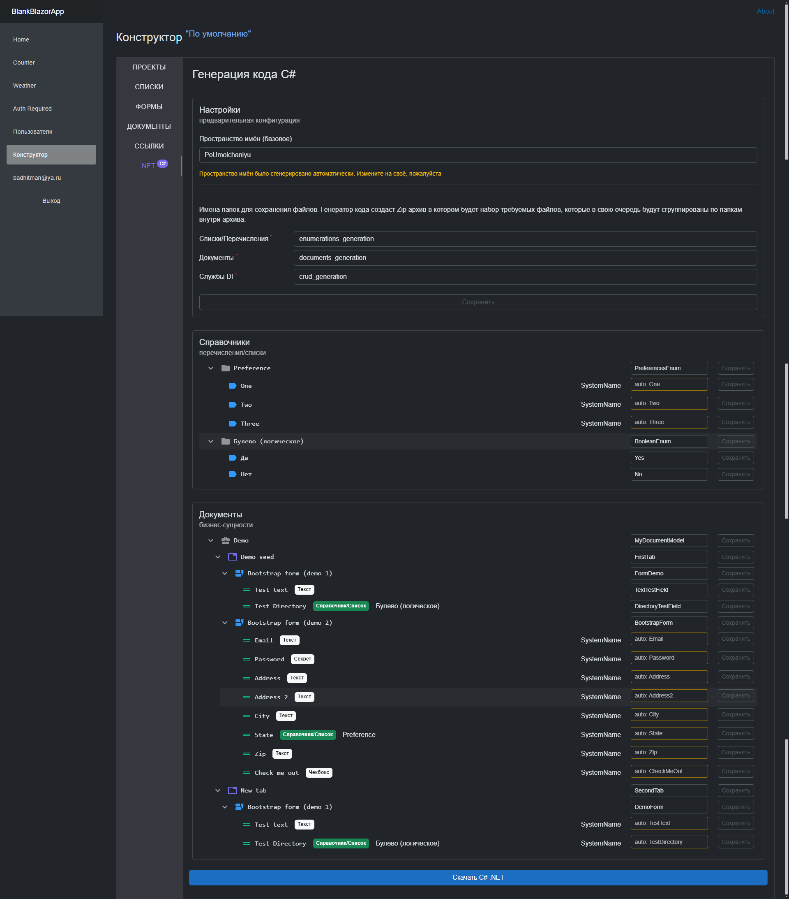

## WEB Конструктор документов (схемы данных).
> развитие базового шаблона '*Blazor NET.8 + TelegramBot*' из ветки [main](https://github.com/badhitman/DesignerApp/tree/main). Другими словами - встроенная поддержка TelegramBot и другие нюансы решения исходной ветки.

Для сборки потребуется ещё один репозиторий [HtmlGenerator](https://github.com/badhitman/HtmlGenerator), который используется для генерации исходников Blazor компонент.

> [!WARNING]
> Миграции EF Core пока что не используются. При каждом изменении схемы БД старая (текущая) база удаляется вручную (СУБД по умолчанию: SqLite) и создаётся [заново двумя командами](https://github.com/badhitman/DesignerApp/blob/main/DBContextLibs/DbSqliteLib/migrations.md). Чистая БД (после пересоздания) благодаря [символам условной компиляции](https://github.com/badhitman/DesignerApp/blob/constructor/ServerLib/ServerLib.csproj#L11) [заполняется DEMO данными](https://github.com/badhitman/DesignerApp/blob/a73c30fd2a44fcebaf66d3a58f16aa46e113947a/ServerLib/Services/ConstructorService.cs#L634). После выхода в релиз 'включатся' и миграции по всем СУБД: [SQLite](https://github.com/badhitman/DesignerApp/tree/constructor/DBContextLibs/DbSqliteLib), [MySQL](https://github.com/badhitman/DesignerApp/tree/constructor/DBContextLibs/DbMySQLLib), [PostgreSQL](https://github.com/badhitman/DesignerApp/tree/constructor/DBContextLibs/DbPostgreLib).

Web решение для конструирования документов, справочников и т.п. Создание схемы документов и структуры моделей без необходимости программировать. Для созданных схем документов есть возможность формировать публичные ссылки/сессии, что бы внешние клиенты могли заполнять ваши документы своими данными (в т.ч. анонимным пользователям). Что-то на подобие web-форм или опросников. У документа есть вкладки/табы для удобной группировки форм внутри документа (как табы/вкладки в Excel).

... исходные файлы ветки [main](https://github.com/badhitman/DesignerApp/tree/main) не редактировались. добавлено [разного UI Blazor](https://github.com/badhitman/DesignerApp/tree/constructor/BlazorServerLib/Components/Constructor). А так же [немного](https://github.com/badhitman/DesignerApp/blob/constructor/DBContextLibs/DbLayerLib/ConstructorLayerContext.cs) [БД](https://github.com/badhitman/DesignerApp/tree/constructor/SharedLib/Models/db/constructor) для [соответствующих](https://github.com/badhitman/DesignerApp/blob/constructor/SharedLib/IServices/main/IConstructorService.cs) [сервисов](https://github.com/badhitman/DesignerApp/blob/constructor/SharedLib/IServices/GeneratorCSharpService.cs).

### Проекты

Проекты могут быть собственные (созданные вами) или гостевые. Гостевые - это те, которые были созданы другими пользователями, а вас туда добавили как участника. Пользователь-владелец может управлять своим проектом, а приглашённые участники могут вместе с владельцем создавать/редактировать списки/справочники, формы с их полями и документы. Владелец проекта может заблокировать возможность участникам вносить правки в структуры данных. Создавать ссылки/сессии на основе существующих документов участники могут всегда вне зависимости от статуса проекта. Сессии - это уже не конструктор, а эксплуатация проектов внешними клиентами.

Гостевые проекты нельзя настраивать или включать/выключать, но их можно использовать: сделать его **основным/действующим** для самого себя. Когда вы задействуете какой-либо проект в роли основного - ваш контекст конструктора переключается на него. Все работы в конструкторе всегда принадлежат какому-то одному проекту, а все участники вместе с владельцем работают в едином общем пространстве имея доступ друг к другу внутри общего проекта. Если создатель/владелец выключит свой проект - дальнейшее редактирование участниками сущностей в этом проекте становится невозможным (режим: *ReadOnly*). Выданные ссылки по прежнему доступны пользователям. Отключение проекта блокирует только возможность вносить изменения в списки/справочники, формы и документы. Любые изменения в сущностях проекта незамедлительно отражаются во всех ссылках, которые связаны с документом. Если у пользователя открыта ссылка с документом, который вдруг изменился (кто-то изменил форму или документ в проекте), то пользователю будет предложено перезагрузить страницу, что бы документ, который он заполняет актуализировался.

### Справочники (перечисления)

Простейшая бизнес-модель (управляемая сущность). По смыслу это обычное перечисление - именованный список простых строк. Примером такой структуры может быть `пол человека: муж, жен;`, `способ связи: телефон, email;` или подобное перечисление доступных значений для какого-то поля формы. В подобных ситуациях используется данный инструмент конструктора. В последствии эти справочники можно будет указать как тип поля формы, а клиент в свою очередь сможет им воспользоваться как обычным селектором.

в ограниченном режиме: *если владелец деактивировал проект*

Списки как и другие сущности проекта по прежнему доступны, но редактировать их сможет либо владелец либо администратор.

### Формы

Форме как и полям формы можно указывать CSS стили, что бы воспользоваться Bootstrap вёрсткой для компоновки/вёрстки полей внутри формы. В частности если указать форме CSS="row", то полям внутри этой формы можно назначать CSS например: col-12 или col-md-6 что бы итоговая форма вела себя соответственно.

Доступные типы полей формы

Добавляя поле на форму можно воспользоваться одним из доступных типов данных. Там же есть тип `Список/Справочник` для того что бы задействовать свё собственное перечисление/справочник. Тип поля `Текст` в свою очередь имеет набор своих вариаций (маски, шаблоны и т.п.). Генератор и Калькуляция это дополнительные универсальные типы полей, которые отображаются в формах при заполнения данными в ссылках/сессиях, но не выгружаются в генераторе кода c#.net

Перечень полей формы

Видно сразу результат настроек полей формы. Внизу отображается область **Demo** *Как это увидит пользователь*.

Контроль корректности настроек полей

Некоторые поля имеют возможность указывать параметры поведения поля. Существует экспресс проверка корректности параметров.

в ограниченном режиме (если проект деактивирован владельцем)

Редактирование поля формы

Поле формы как и форма имеет свойство CSS стилей, что в комплексе с используемым Bootstrap позволяет управлять вёрсткой/компоновкой элементов формы.

в случае выключено проекта форма доступна только для просмотра

### Документы (схема)
Конечный результат конструирования. Тут указывается количество табов/вкладок и их состав.

В финале конструируется схема документа. Документ имеет вкладки/табы похожие на те что существуют в Excel, что позволяет разделить сложные документы на разные области, где каждая будет содержать свой набор форм и настройки.

Добавление форм на вкладки/табы

При добавлении формы на вкладку/таб, ей можно указать режим "Таблица". В таком случае будет отображаться именно таблица с теми полями, которые есть у формы, а процесс добавления и редактирование строк будет происходить во всплывающем окне с вашей формой как вы её настроили в соответствующем конструкторе.

### Ссылки/сессии
Всё что конструировалось в конструкторе на данном этапе только макеты/схемы/структура данных, которые можно выгрузить через генератор кода. Если требуется сразу начать заполнять ваши документы реальными данными следует создать сессию/ссылку для вашего нужного документа. По ссылке пользователю доступна форма для заполнения:

В данном случае документ содержит одну вкладку, но их может быть сколько угодно и на каждой вкладке любое количество любых форм. Ссылку можно сделать доступной анонимным пользователям просто по уникальному URL.

управление сессией/ссылкой:

Ссылке можно указать срок жизни/актуальности. по окончанию этого срока вносить данные станет невозможно. Разумеется есть возможность указать новый дедлайн дату, чем продлить срок доступа к внесению данных в документы. Кроме того GUID для ссылки можно удалить или даже перевыпустить новый. Именно по такому GUID возможен доступ к сессии анонимным пользователям. Если удалить токен у сессии, то она становится вовсе недоступна анонимным пользователям, но доступна авторизованным участникам проекта в рамках которого эта ссылка выпущена. Пока токен существует у сессии - любой человек зная этот GUID может по меньшей мере прочитать данные, а в случае доступности режима редактирования смогут изменять их. Уполномоченные участники соответствующих проектов после авторизации и переключения на нужный проект могут получить доступ соответственно статусу сессии и правам пользователя.

созданные ссылки в текущем проекте

### Генератор кода C#
Генератор кодовой базы. !!!Решение на ранней стадии реализации.

Формы, которые можно заполнять сразу в конструкторе при помощи создания ссылки/сессии имеют важный недостаток: все данные всех форм хранятся в одной общей таблице в строковом формате. Такая структура базы данных сгодиться для проведения опросов и анкетирования, но такая БД не пригодна к полноценному использованию, поэтому существует генератор кода.

Генератор позволяет выгрузить/скачать проект одним файлом в котором будет находиться готовая значительная часть C# кода: перечисления, модели для базы данных и сам контекст БД {[demo пример](./demo-codebase.zip)}. Так же сформируется комплект DI сервисов с реализацией базовых CRUD операций и Blazor GUI для использования получившегося комплекта. Такой набор кода можно будет без труда внедрить в заготовку из основной ветки [main](https://github.com/badhitman/DesignerApp/tree/main) и в итоге получить частично готовое приложение полученное из метаданных конструктора вашего проекта. В WEB конструкторе могут работать любые пользователи - там не потребуются познания в программировании, а в результате можете получить готовую информационную систему с нормальной структурой DB и базовыми возможностями работы с новоиспечённой ИС.

> [!TIP]
> Безусловно, комплект кода, полученный из генератора, нельзя будет назвать окончательно готовым/финальным. Наверняка приложению потребуется множество дополнительной бизнес-логики, но типовые операции будут доступны сразу. В таком приложении можно сразу работать по крайней мере в рамках **CRUD** операций над вашими бизнес-сущностями.