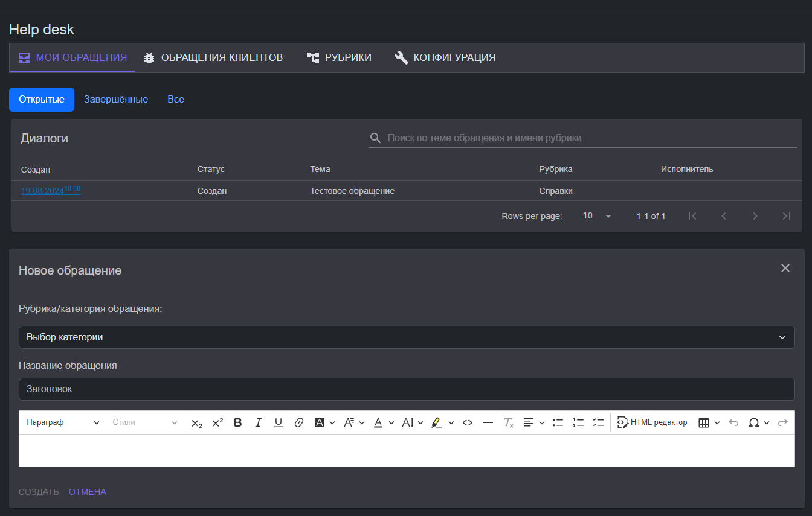
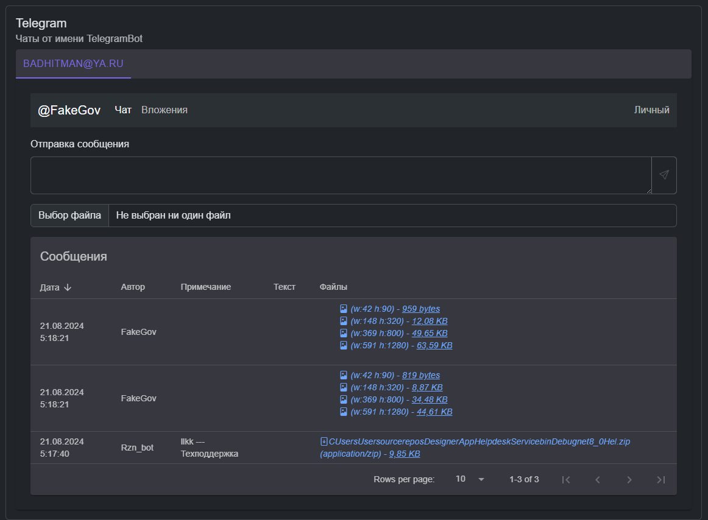
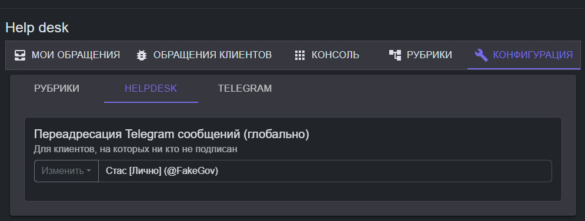

Клиенты могут отправлять свои обращения через web сайт используя свои логин/пароль, либо прямо из Telegram. Таким образом клиенту не обязательно посещать сайт. Клиенту не обязательно даже иметь аккаунт (регистрироваться на сайте). Уведомления рассылаются от бота Телеграм и/или Email.
Кроме того, бэк данной информационной системы можно использовать отдельно от фронта: связь между фронтом и бэком через RabbitMQ.

## Рубрики

Категории/рубрики обращений. Кроме текста самого обращения клиент должен указать категорию/рубрику/тему. Это меню редактируется/настраивается отдельно (вложенность не ограничена). Режим выбора клиентом рубрик [настраивается отдельно](https://github.com/badhitman/DesignerApp/tree/main/HelpdeskService#%D0%BD%D0%B0%D1%81%D1%82%D1%80%D0%BE%D0%B9%D0%BA%D0%B8).

## Журнал

Журнал обращений. В зависимости от прав набор вкладок/доступов различный.
Для исполнителя журнал похож на клиентский. Ключевое отличие заключается в работе фильтров.

## Диалог внутри обращения

В любом обращении сотрудникам доступна карточка клиента текущего автора обращения:

В карточке клиента доступны настройки пересылки ботом входящие сообщения от клиента и записки.

#### TelegramBot уведомления (пересылка сообщений клиентов)
Можно установить переадресацию для клиента, что бы все его сообщения в TelegramBot пересылались в групповой чат или лично сотруднику. Другими словами: при входящем сообщении от клиента система сначала проверит наличие подписки персонально для клиента что бы переслать туда сообщение. Что бы настроить переадресацию глобально для клиентов без активных подписок предусмотрена [настройка](https://github.com/badhitman/DesignerApp/tree/main/HelpdeskService#%D0%BF%D0%B5%D1%80%D0%B5%D0%B0%D0%B4%D1%80%D0%B5%D1%81%D0%B0%D1%86%D0%B8%D1%8F-telegram-%D0%B3%D0%BB%D0%BE%D0%B1%D0%B0%D0%BB%D1%8C%D0%BD%D0%BE). Все пересылаемые от клиентов сообщения поддерживают экспресс-ответ: если ответить на такое (пересланное) сообщение бота, тогда этот ответ будет отравлен ботом клиенту.

#### Записки
Доступны два варианта записок:
- о клиенте, который привязан к автору обращения один общий для всех сотрудников.
- приватный, который ваш личный и привязан непосредственно к обращению. его видите только вы и только когда откроете соответствующую заявку/обращение.

В связи с тем что хранится это в службе общих/разделяемых параметров - данная подсистема ведёт историю этих значений (ротация настраивается уже в самом сервисе хранения данных)

### Сообщения

### TelegramBot

Все участники (у которых привязан Telegram) доступны в области TelegramBot чатов. Можно сразу вести переписку с клиентом (или исполнителем, подписчиком) напрямую от имени бота - отправленные тут сообщения регистрируются = попадают в хронику обращения и добавляется как комментарий к обращению от имени системной учётной записи. В этот диалог попадают все пользователи, связанные с данным обращением: подписчики, автор, исполнитель. Если в обращении не окажется ни одного пользователя с подтверждённым Telegram, тогда эта область не отобразится совсем.
Двусторонняя поддержка отправки/приёмки файлов: отправленные клиентом боту файлы доступны в консоли так же как и отправка файлов клиенту от имени бота.

### События (SLA)

История всех изменений в хронологическом порядке. В последствии эти записи позволят извлекать SLA аналитику. Кроме того в [службе регистрации событий](/HelpdeskService/Services/Receives/issues/pulse/PulseIssueReceive.cs) размещён механизм рассылки уведомлений подписчикам, что позволит устроить гибкую/настраиваемую подсистему подписок на уведомления.

## Настройки

Параметры системы

### Командный режим TelegramBot
Если вы не предусмотрели свой специализированный обработчик входящих сообщений в TelegramBot, тогда включите командный режим:

Это параметр не **HelpDesk**, а именно бота. Таким образом бот перестанет обрабатывает простые текстовые сообщения от пользователей. В этом режиме простые текстовые сообщения в бота не обрабатываются автоответчиком (равно как и отправленные файлы, документы и т.п.). Сообщения сохраняются, но ответ не формируется если это не команда или **CallbackQuery**. Команды в TelegramBot начинаются с косой черты (/). Таким образом в командном режиме бот будет пытаться выполнить/бработать входящее сообщение только если текст сообщения является командой: начинается с косой черты (/) либо в случае если это **CallbackQuery**, а в остальных случаях клиент будет в свободной форме вести чат с ботом, а сотрудники **HelpDesk** должны будут ему отвечать от имени бота через консоль или воспользовавшись *'экспресс-ответом в чате'*.

#### Переадресация Telegram (глобально)
Следует указать чат в который будут переадресованы сообщения от новых клиентов, т.е. от тех клиентов, на которых ни кто из сотрудников не подписан. Клиентам можно устанавливать [переадресации на группы или на персональные чаты сотрудников](https://github.com/badhitman/DesignerApp/tree/main/HelpdeskService#telegrambot-%D1%83%D0%B2%D0%B5%D0%B4%D0%BE%D0%BC%D0%BB%D0%B5%D0%BD%D0%B8%D1%8F-%D0%BF%D0%B5%D1%80%D0%B5%D1%81%D1%8B%D0%BB%D0%BA%D0%B0-%D1%81%D0%BE%D0%BE%D0%B1%D1%89%D0%B5%D0%BD%D0%B8%D0%B9-%D0%BA%D0%BB%D0%B8%D0%B5%D0%BD%D1%82%D0%BE%D0%B2), но если в бота написал клиент без активной подписки, такие сообщения пересылаются например в общий чат первой линии поддержки.
