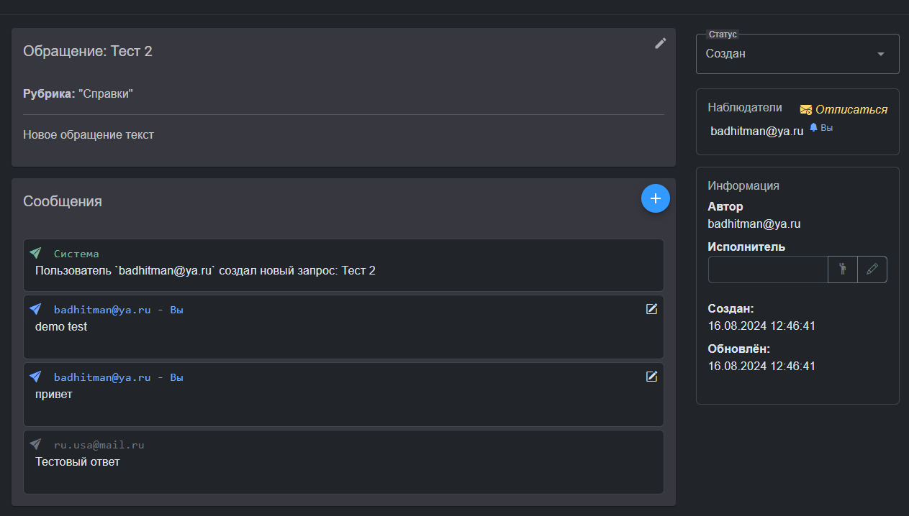
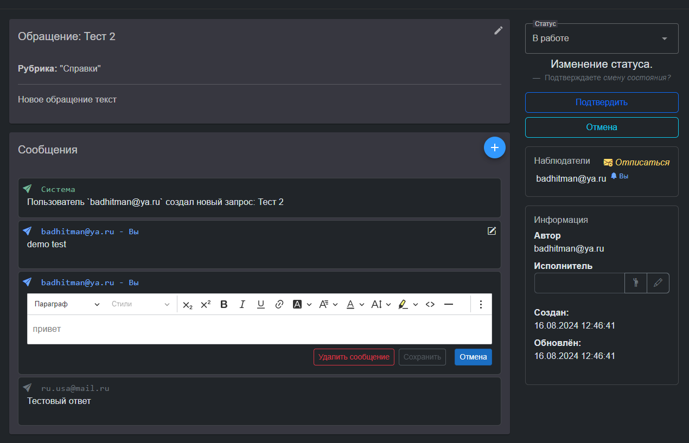
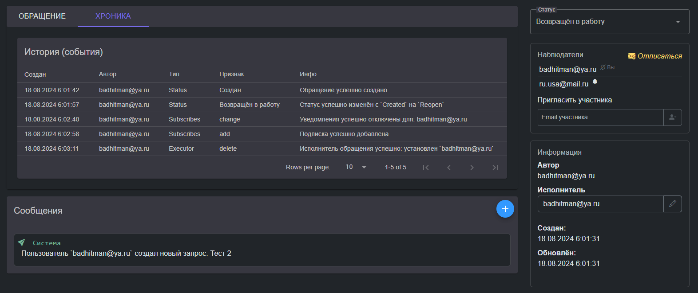
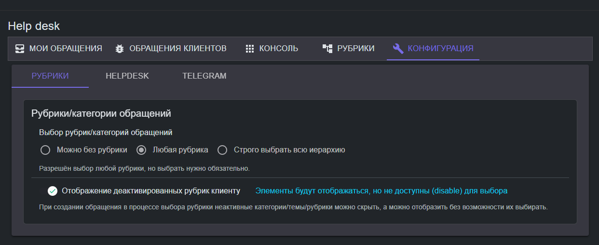

Клиенты могут отправлять свои обращения через web сайт используя свои логин/пароль, либо прямо из Telegram [WebApp](https://core.telegram.org/bots/webapps). Таким образом клиенту не обязательно посещать сайт. Клиенту не обязательно даже иметь аккаунт (регистрироваться на сайте). Сотрудники, управляющие и админ тоже могут пользоваться удобством WebApp. Уведомления рассылаются от бота Телеграм и/или Email.

## Рубрики

Темы обращений. Кроме текста самого обращения клиент должен указать категорию/рубрику/тему. Эта структура редактируется отдельно.

## Журнал

Журнал обращений. В зависимости от прав набор вкладок/доступов различный

## Диалог внутри обращения

### Сообщения

### TelegramBot

Все участники (у которых привязан Telegram) доступны в области TelegramBot чатов. Можно сразу вести переписку с клиентом напрямую от имени бота - отправленные тут сообщения регистрируются = попадают в хронику обращения и добавляется как комментарий к обращению от имени системной учётной записи. Сюда попадают все пользователи, связанные с данным обращением: подписчики, автор, исполнитель. Если в обращении не окажется ни одного пользователя с подтверждённым Telegram, тогда эта область не отобразится совсем.

### События (SLA)

История всех изменений в хронологическом порядке. В последствии эти записи теоретически позволят получать SLA аналитику. Кроме того в [службе регистрации событий](/HelpdeskService/Services/Receives/issues/pulse/PulseIssueReceive.cs) размещён механизм рассылки уведомлений подписчикам

## Настройки

Параметры системы