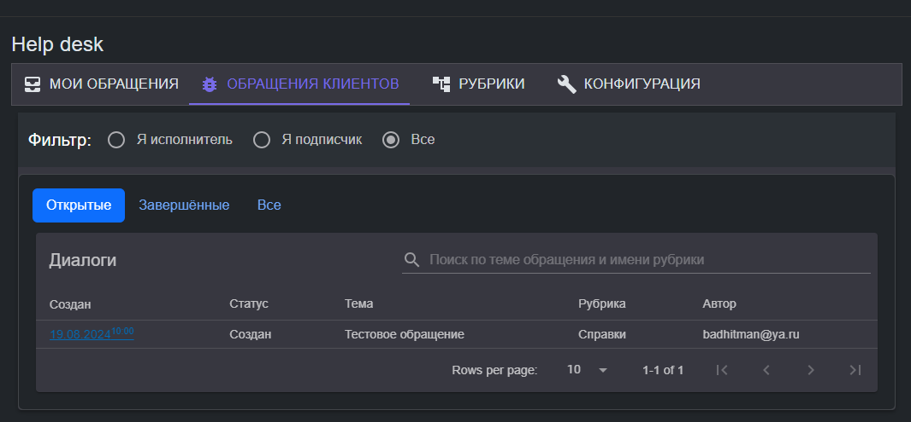
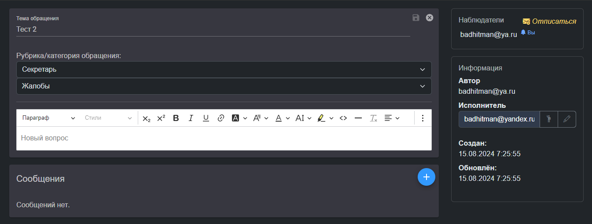
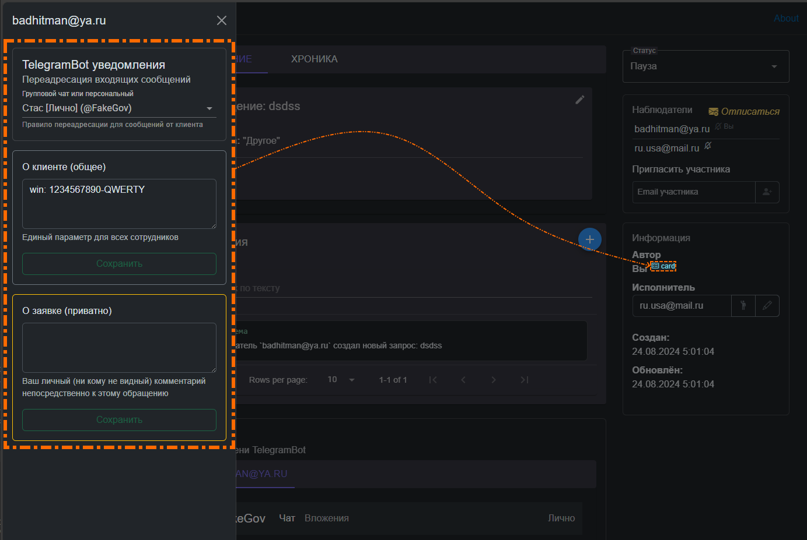

Клиенты могут отправлять свои обращения через web сайт используя свои логин/пароль, либо прямо из Telegram. Таким образом клиенту не обязательно посещать сайт. Клиенту не обязательно даже иметь аккаунт (регистрироваться на сайте). Уведомления рассылаются от бота Телеграм и/или Email.
Кроме того, бэк данной информационной системы можно использовать отдельно от фронта: связь между фронтом и бэком через RabbitMQ.

## Рубрики

Категории/рубрики обращений. Кроме текста самого обращения клиент должен указать категорию/рубрику/тему. Это меню редактируется/настраивается отдельно.

## Журнал

Журнал обращений. В зависимости от прав набор вкладок/доступов различный.
Для исполнителя журнал похож на клиентский. Ключевое отличие заключается в работе фильтров.

## Диалог внутри обращения

В любом обращении вам доступна карточка клиента текущего автора обращения:

Доступны два варианта записок:
- о клиенте, который привязан к автору обращения один общий для всех сотрудников.
- приватный, который ваш личный и привязан непосредственно к обращению. его видите только вы и только когда откроете эту соответствующую заявку/обращение.

### Сообщения

### TelegramBot

Все участники (у которых привязан Telegram) доступны в области TelegramBot чатов. Можно сразу вести переписку с клиентом (или исполнителем, подписчиком) напрямую от имени бота - отправленные тут сообщения регистрируются = попадают в хронику обращения и добавляется как комментарий к обращению от имени системной учётной записи. В этот диалог попадают все пользователи, связанные с данным обращением: подписчики, автор, исполнитель. Если в обращении не окажется ни одного пользователя с подтверждённым Telegram, тогда эта область не отобразится совсем.
Двусторонняя поддержка отправки/приёмки файлов: отправленные клиентом боту файлы доступны в консоли так же как и отправка файлов клиенту от имени бота.

### События (SLA)

История всех изменений в хронологическом порядке. В последствии эти записи позволят извлекать SLA аналитику. Кроме того в [службе регистрации событий](/HelpdeskService/Services/Receives/issues/pulse/PulseIssueReceive.cs) размещён механизм рассылки уведомлений подписчикам, что позволит устроить гибкую/настраиваемую подсистему подписок на уведомления.

## Настройки

Параметры системы

Если вы не предусмотрели свой специализированный обработчик входящих сообщений в TelegramBot, тогда включите командный режим:

Это параметр не HelpDesk, а именно бота. Таким образом бот перестанет обрабатывает простые текстовые сообщения от пользователей. В этом режиме простые текстовые сообщения в бота не обрабатываются автоответчиком (равно как и отправка файлов, документов и т.п.). Сообщения сохраняются, но ответ не формируется если это не команда или **CallbackQuery**. Команды в TelegramBot начинаются с косой черты (/). Таким образом в командном режиме бот будет пытаться выполнить/бработать входящее сообщение только если текст сообщения является командой: начинается с косой черты (/) либо в случае если это **CallbackQuery**, а в остальных случаях клиент будет в свободной форме вести чат с ботом, а сотрудники HelpDesk должны будут ему отвечать от имени бота через консоль.