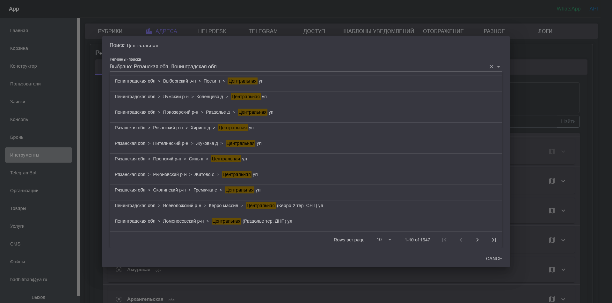

## КЛАДР 4.0

Отображение полей настраивается (**uno**, **ocatd**, **code**, **gninmb**). Для каждого адреса справа доступна кнопка открытия Яндекс карт и ссылка открытия почтового отделения (*для тех элементов, у кого индекс установлен в КЛАДР*).

Процесс загрузки классификатора и обработка сервером этих данных происходит в три этапа (полуавтоматически):
- Первый этап: запуск обмена - завершается довольно быстро (за несколько минут). Когда пользователь нажимает кнопку "ОТПРАВИТЬ", данные не записываются сразу в БД, а ставятся в очередь на обработку, т.е. данные фактически доставляются с клиента в удалённую систему, но удалённая служба записывает данные поочерёдно одну за одной. Каждая порция данных идёт как отдельная задача, а узел службы (либо узлы, если их несколько) обрабатывают эту очередь в меру общей производительности. 
- Второй этап: запись полученных данных во временную базу - может длиться довольно долго (до часа). Сам процесс запускается автоматически вместе с началом загрузки данных, но заканчивается позже. На этом этапе клиент уже ни как не учувствует и может быть закрыт. Теперь происходит непосредственная запись данных в базу (6+ млн. строк данных), что требует времени/ресурсов от сервера. Данные в данном случае записываются не в продуктовую БД, а во временную (т.е. ещё не влияют на продуктовый контур). Таким образом после выполнения первого этапа выгрузки данных нужно дождаться окончания обработки/записи этих данных непосредственно в БД. Мониторинг текущего состояния очереди обеспечивается благодаря возможностям штатного плагина RabbitMQ `rabbitmq_management` (можно видеть запущенные задачи обмена в очереди задач):

- Третий этап (заключительный): ручной транзит готовых данных из временной бд в продуктовую - может длиться до нескольких минут. Замена данных выполняется в единой транзакции: очистка продуктовой бд + копирование подготовленных данных из временной бд. В случае ошибки транзакция СУБД автоматически откатится в исходное состояние.

RabbitMQ - параметр `consumer_timeout = 3600000` требуется для того что бы очередь загрузки КЛАДР благополучно обработалась. Стандартных 30 минут может не хватить. Рекомендуется использовать в таких случаях 3600000 ms (=один час).
Пользователю RabbitMQ нужна TAG/роль management. Для мониторинга текущего существования/статуса задачи загрузки данных - используется rest/api RabbitMQ.