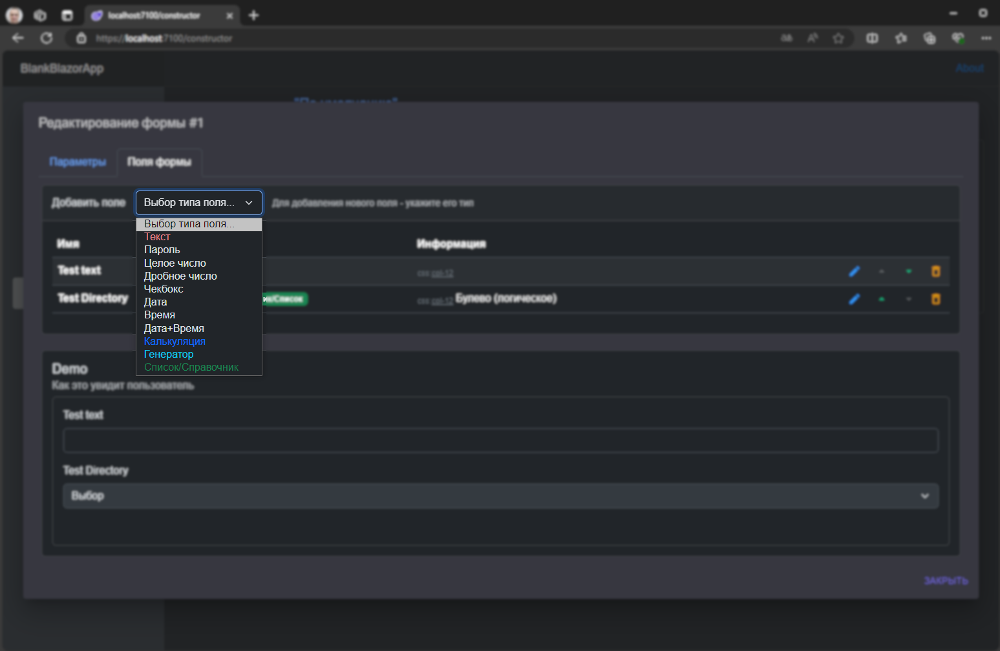
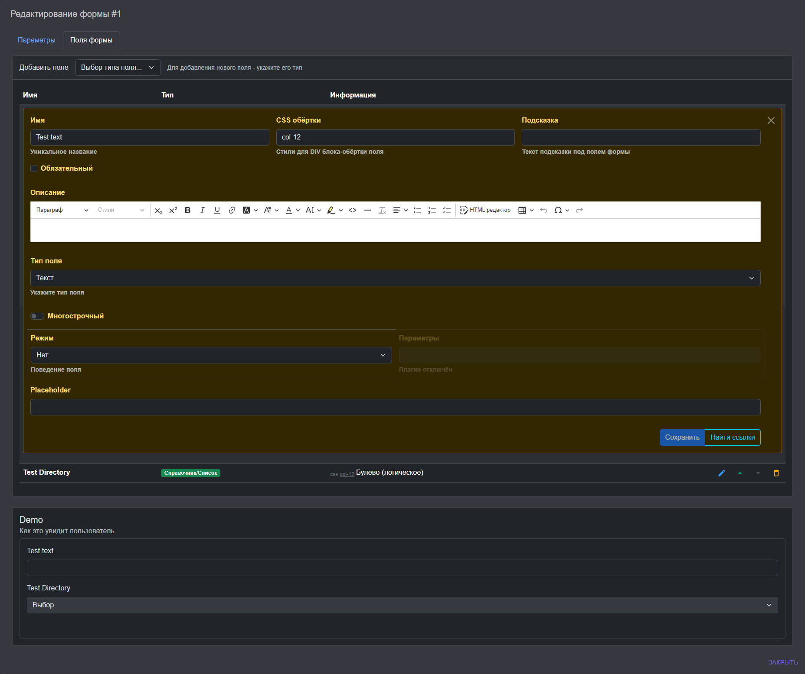
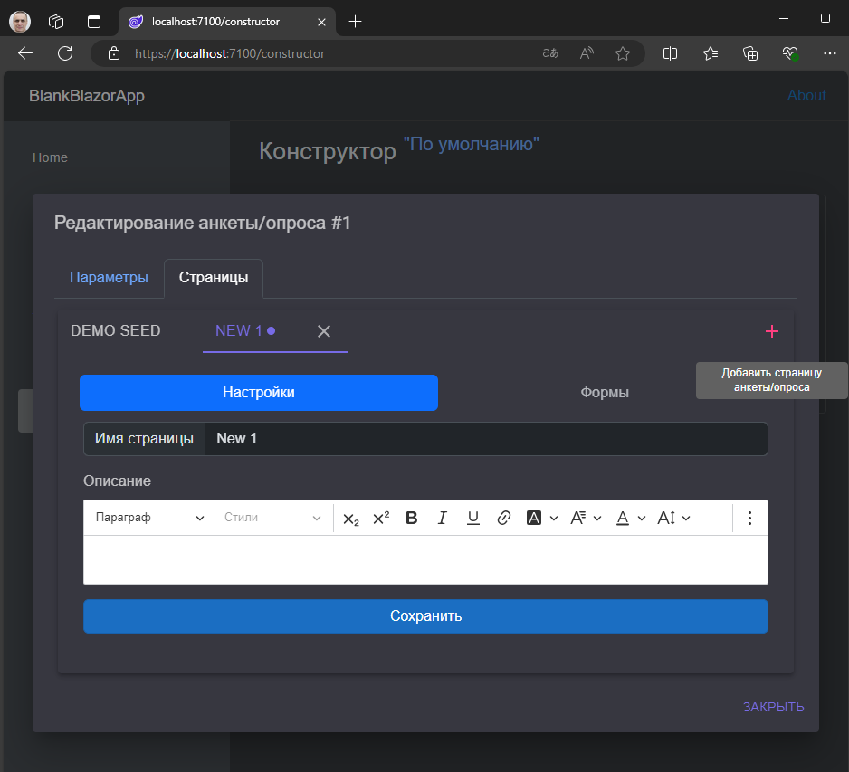
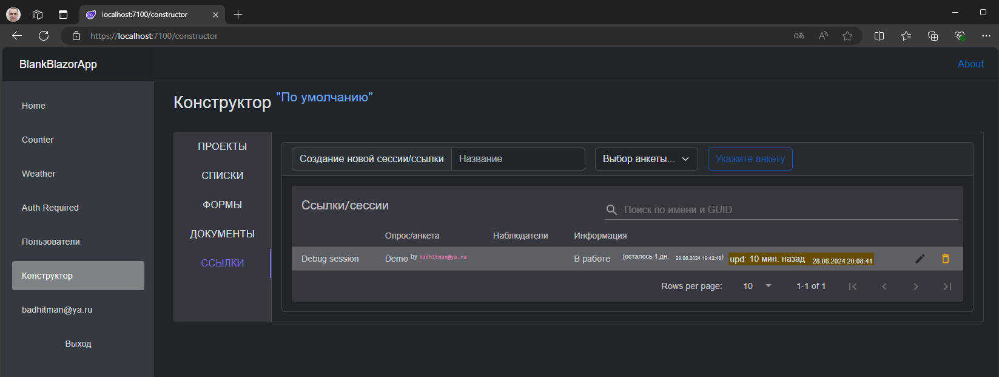

## WEB Конструктор документов (схемы данных).
> развитие базового шаблона '*Blazor NET.8 + TelegramBot*' из ветки [main](https://github.com/badhitman/DesignerApp/tree/main). Другими словами - встроенная поддержка TelegramBot и другие нюансы решения исходной ветки.

Web решение для конструирования документов, справочников и т.п. Создание схемы документов и структуры моделей в общих чертах. Для созданных схем документов есть возможность формировать публичные ссылки/сессии, что бы внешние клиенты могли заполнять ваши документы своими данными. Что-то на подобие Веб-форм или опросников. У документа есть вкладки/табы для удобной группировки форм внутри документа.

... исходные файлы ветки [main](https://github.com/badhitman/DesignerApp/tree/main) не редактировались. добавлено [разного UI Blazor](https://github.com/badhitman/DesignerApp/tree/constructor/BlazorServerLib/Components/Constructor). А так же [немного](https://github.com/badhitman/DesignerApp/blob/constructor/DBContextLibs/DbLayerLib/ConstructorLayerContext.cs) [БД](https://github.com/badhitman/DesignerApp/tree/constructor/SharedLib/Models/db/constructor) для [соответствующих](https://github.com/badhitman/DesignerApp/blob/constructor/SharedLib/IServices/main/IConstructorService.cs) [сервисов](https://github.com/badhitman/DesignerApp/blob/constructor/SharedLib/IServices/GeneratorCSharpService.cs).

### Проекты

Проекты могут быть собственные (созданные вами) и гостевые. Гостевые - это те, которые были созданы другими пользователями, а вас туда добавили как участника. Пользователь-владелец может управлять своим проектом, а приглашённые участники могут вместе с владельцем создавать/редактировать списки/справочники, формы с их полями и документы. Владелец проекта может деактивировать проект - чем заблокирует возможность участникам вносить правки в структуры данных. Создавать ссылки/сессии на основе существующих документов участники могут всегда вне зависимости от статуса проекта. Сессии - это уже не конструктор, а эксплуатация проектов внешними клиентами.

Гостевые проекты нельзя редактировать или включать/выключать, но их можно использовать: сделать его **основным/действующим** для самого себя. Когда вы задействуете какой-либо проект в роли основного - ваш контекст конструктора переключается на него. Все работы в конструкторе всегда принадлежат какому-то одному проекту, а все участники вместе с владельцем работают в едином общем пространстве имея доступ друг к другу внутри общего проекта. Если создатель/владелец выключит свой проект - дальнейшее редактирование участниками сущностей в этом проекте становится невозможным. Выданные ссылки по прежнему доступны пользователям. Отключение проекта блокирует только возможность вносить изменения в списки/справочники, формы и документы. Любые изменения в сущностях проекта незамедлительно отражаются во всех ссылках, которые связаны с документом. Если у пользователя открыта ссылка с документом, который вдруг изменился (кто-то изменил форму или документ в проекте), то пользователю будет предложено перезагрузить 

### Справочники (перечисления)

простейшая бизнес-модель (управляемая сущность). По смыслу это обычное перечисление - именованный список простейших строк. Примером такой структуры может быть `пол человека: муж, жен;`, `способ связи: телефон, email;` или подобное перечисление доступных значений для какого-то поля формы. Для подобных ситуаций используется этот вид конструктора. В последствии эти справочники можно будет указать как тип поля формы, а клиент в свою очередь сможет им воспользоваться как обычным селектором.

в ограниченном режиме: *если владелец деактивировал проект*

списки как и другие сущности проекта по прежнему доступны, но редактировать их сможет либо владелец либо администратор.

### Формы

Форме как и полям формы можно указывать CSS стили, что бы воспользоваться Bootstrap вёрсткой для компоновки/вёрстки полей внутри формы. В частности если указать форме CSS="row", то полям внутри этой формы можно назначать CSS например: col-12 или col-md-6 что бы итоговая форма вела себя соот

Доступные типы полей формы

Добавляя поле на форму можно воспользоваться одним из доступных типов данных. Там же есть тип `Список/Справочник` для того что бы задействовать свё собственное перечисление/справочник. Тип поля `Текст` в свою очередь имеет набор своих вариаций (маски, шаблоны и т.п.).

Перечень полей формы

Видно сразу результат настроек полей формы. внизу отображается область **Demo** *Как это увидит пользователь*.

в ограниченном режиме (если проект деактивирован владельцем)

Редактирование поля формы

Поле формы как и форма имеет свойство CSS стилей, что в комплексе с используемым Bootstrap позволяет управлять вёрсткой формы.

в случае выключено проекта форма доступна только для просмотра

### Документы (схема)
Конечный результат конструирования. Тут указывается количество табов/вкладок и их состав.

В финале конструируется схема документа. Документ имеет вкладки/табы похожие на те что существуют в Excel. Это позволяет разделить сложные документы на разные области, где каждая будет содержать свой набор форм и настройки.

Добавление форм на вкладки/табы

При добавлении формы на вкладку/таб, ей можно указать режим "Таблица". В таком случае будет отображаться именно таблица с теми полями, которые есть у формы, а процесс добавления и редактирование строк будет происходить во всплывающем окне с вашей формой как вы её настроили в соответствующем конструкторе.

### Ссылки/сессии
Всё что конструировалось в конструкторе на данном этапе только макеты/схемы/структура данных, но их нельзя заполнять заполняя их поля форм какими то значениями. Если требуется заполнить какой-либо документ реальными данными нужно создать сессию/ссылку для вашего документа. По ссылке пользователю доступна форма для заполнения:

в данном случае документ содержит одну вкладку, но их может быть сколько угодно и на каждой вкладке любое количество любых форм. Ссылку можно сделать доступной анонимным пользователям просто по уникальному URL.

управление сессией/ссылкой:

ссылке можно указать срок жизни/актуальности. по окончанию этого срока вносить данные станет невозможно. Разумеется есть возможность указать новый дедлайн дату, чем продлить срок доступа к внесению данных в документы. Кроме того GUID для ссылки можно удалить или даже перевыпустить новый. Именно по такому GUID возможен доступ к сессии анонимным пользователям. Если удалить токен у сессии, то она становится вовсе недоступна анонимным пользователям, но доступна участникам проекта в рамках которого эта ссылка выпущена. Пока токен существует у сессии - любой человек зная этот GUID может по меньшей мере прочитать данные, а в случае доступности режима редактирования смогут изменять их. Уполномоченные участники соответствующих проектов после авторизации и переключения на нужный проект могут получить доступ соответственно статусу сессии и правам пользователя.

созданные ссылки в текущем проекте

### Генератор кода C#
Генератор кодовой базы на данный момент в стадии создания и работает довольно непредсказуемо.

Генератор позволит скачать готовую значительную часть C# кода: перечисления, модели для базы данных и сам контекст БД. Так же набор DI сервисов с базовым CRUD набором операций и Blazor интерфейсы для этого. Этот набор кода можно будет без трудностей внедрить в заготовку из основной ветки [main](https://github.com/badhitman/DesignerApp/tree/main) и получить частично готовое приложение из конструктора
> [!TIP]
> Готовым такой комплект кода нельзя назвать и потребуется провести ревизию того что получилось. Наверняка потребуется множество дополнительной бизнес-логики в приложении, но типовые операции будут выполнены заранее. В таком приложении сразу можно работать по крайней мере в рамках CRUD операций над вашими бизнес-сущностями.