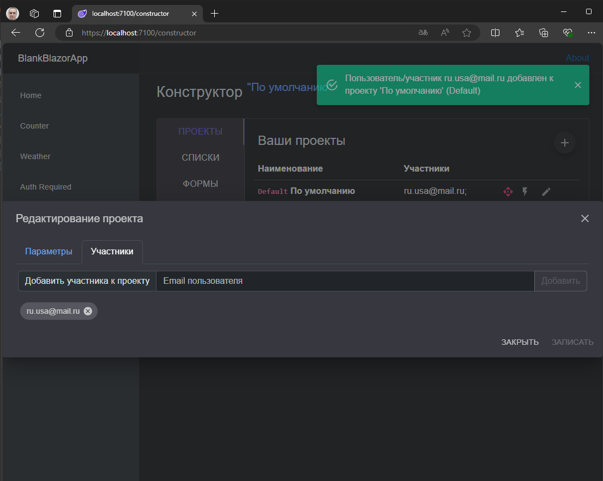
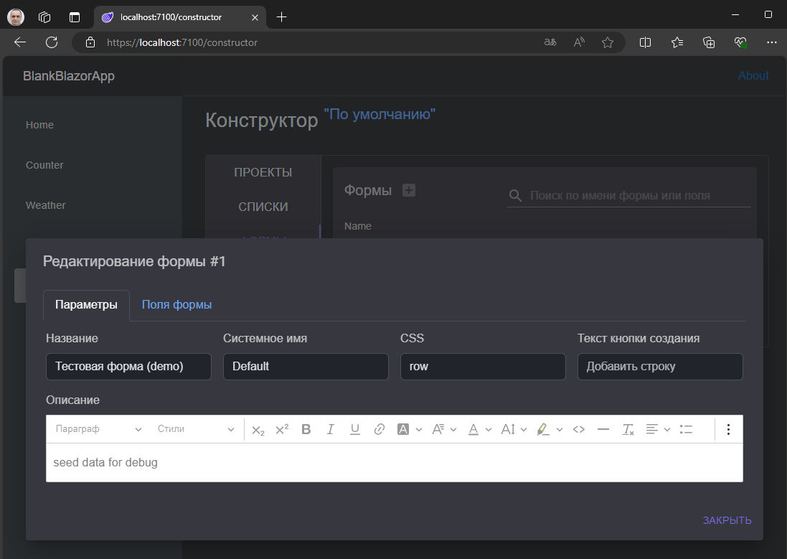
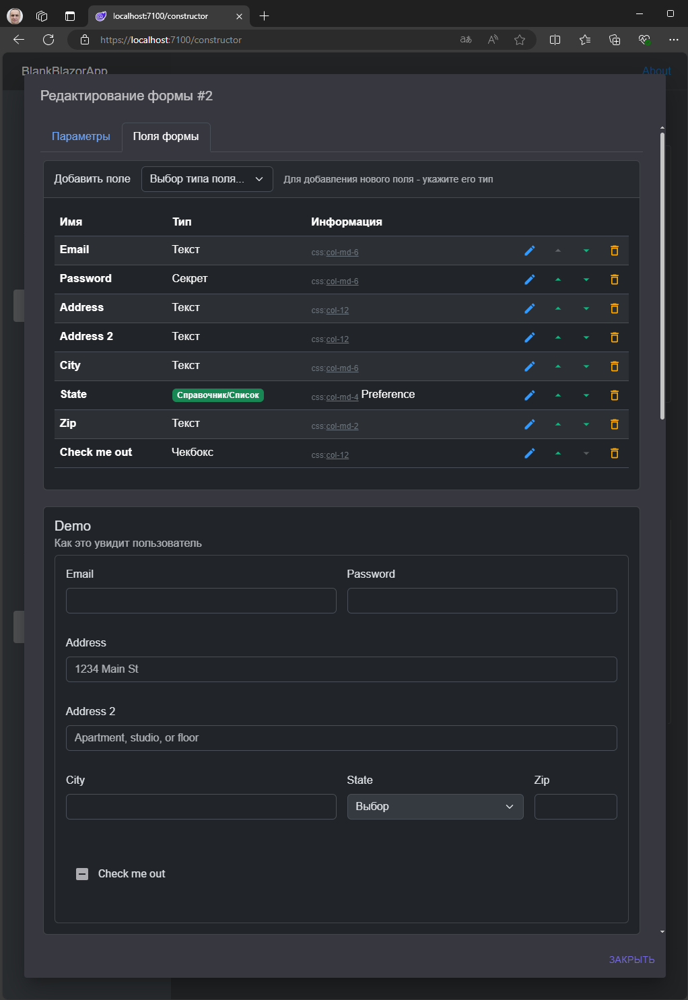
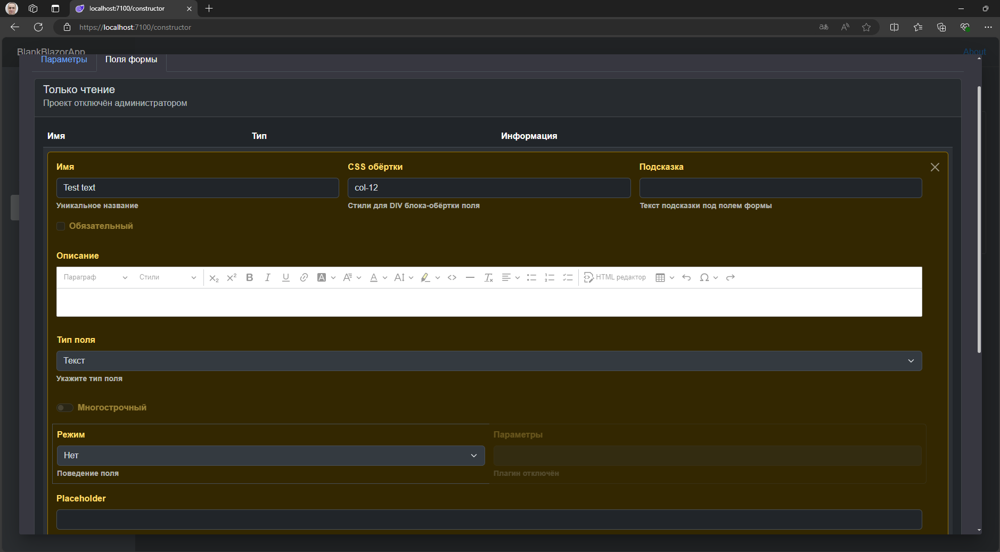
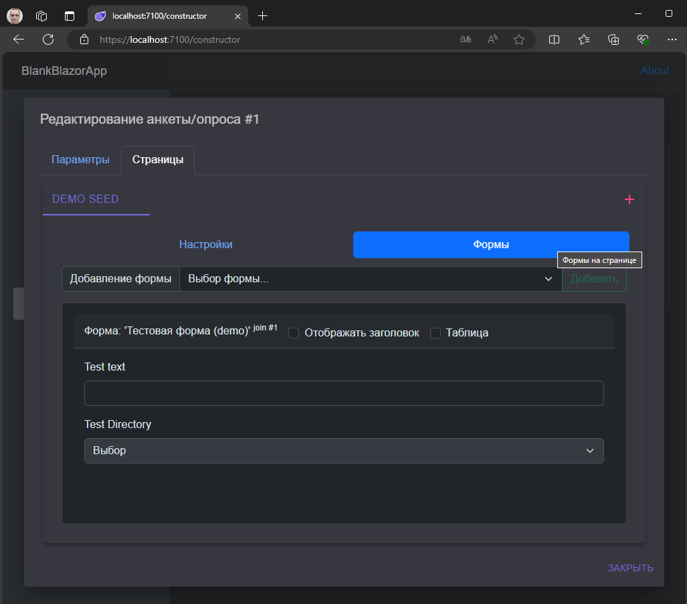

## Конструктор документов (*стадия активной разработки*).
> как развитие базового кейса '*Blazor NET.8 + TelegramBot*' из ветки [main](https://github.com/badhitman/DesignerApp/tree/main). Другими словами там уже есть встроенная поддержка TelegramBot и другие нюансы решения из основной ветки.

**Constructor** - гибкое web решение для конструирования документов, справочников и т.п.

- [x] первая фаза "конструктор" - создание схемы документов и структуры моделей в общих чертах. возможность формировать ссылки/сессии, что бы внешние клиенты могли заполнять документы своими данными.
- [ ] вторая фаза "генератор" - генерация кода .net c# кода. будет создан инструмент формирования кодовой базы, пригодной для натягивания на базовый проект из ветки [main](https://github.com/badhitman/DesignerApp/tree/main). получившееся приложение не сможет считаться готовым к использованию, но в нём будет готово большое количество сервисов с базовым набором функциональности доступа к данным и управления ими CRUD. многие сотни (или тысячи) строк рутинного кода будут сформированы автоматически на основе схемы проекта. после этого останется много работы что бы доработать поведение до требуемого.

первая фаза в финальной стадии. отыскиваю/отлаживаю баги и документирую.

... добавлено [разного UI на Blazor](https://github.com/badhitman/DesignerApp/tree/constructor/BlazorServerLib/Components/Forms). А так же [немного](https://github.com/badhitman/DesignerApp/blob/constructor/DBContextLibs/DbLayerLib/ConstructorLayerContext.cs) [БД](https://github.com/badhitman/DesignerApp/tree/constructor/SharedLib/Models/db/forms) для [соответствующего сервиса](https://github.com/badhitman/DesignerApp/blob/constructor/SharedLib/IServices/main/IFormsService.cs).

### Проекты

проекты могут быть как свои так и гостевые. Гостевые - это те, которые были созданы другими пользователями, а вас туда добавили как участника. Пользователь может управлять проектом, а приглашённые участники могут вместе с владельцем создавать/редактировать списки/справочники, формы с их полями и документы. Владелец проекта может выключить проект - чем заблокирует возможность участникам вносить правки в данные. Создавать ссылки/сессии на основе существующих документов участники могут всегда вне зависимости от статуса проекта.

Гостевые проекты нельзя редактировать или включать/выключать, но их можно использовать: сделать основным/действующим. Когда вы задействуете какой-либо проект в роли основного - ваш контекст конструктора переключается на него. Все работы в конструкторе всегда принадлежат какому-то одному проекту, а все участники вместе с владельцем работают в едином общем пространстве имея доступ друг к другу. Если создатель/владелец выключит свой проект - дальнейшее редактирование участниками сущностей в этом проекте становится невозможным. Выданные ссылки по прежнему доступны пользователям. Отключение проекта блокирует только возможность вносить изменения в списки/справочники, формы и документы. Любые изменения в сущностях проекта незамедлительно отражаются во всех ссылках, которые связаны с документом.

### Справочники (перечисления)

простейшая бизнес-модель (управляемая сущность). По смыслу это обычное перечисление - именованный список простейших строк. Примером такой структуры может быть `пол человека`: `муж`, `жен`; или `способ связи`: `телефон`, `email`; Для подобных ситуаций используется этот вид конструктора. В последствии эти справочники можно будет указать как тип поля формы, а клиент в свою очередь сможет им воспользоваться как обычным селектором.

в ограниченном режиме: *если владелец деактивировал проект*

списки по прежнему доступны, но редактировать их сможет либо владелец либо администратор.

### Формы

форме как и полям формы можно указывать CSS стили, что бы воспользоваться Bootstrap вёрсткой.

Доступные типы полей формы

Добавляя поле на форму можно воспользоваться одним из доступных типов данных. Там же есть тип `Список/Справочник` для того что бы задействовать свой собственный список.

Перечень полей формы

видно сразу результат настроек полей формы. внизу отображается область **Demo** *Как это увидит пользователь*.

в ограниченном режиме (если проект деактивирован владельцем)

Редактирование поля формы

поле формы как и форма имеет свойство CSS стилей, что в комплексе с используемым Bootstrap позволяет управлять вёрсткой формы.

в случае выключено проекта форма доступна только для просмотра

### Документы (схема)
Конечный результат конструирования. Тут указывается количество табов/вкладок и их состав.

в финале конструируется схема документа. Документ имеет вкладки/табы похожие на те что существуют в Excel. Это позволяет разделить сложные документы на разные области, где каждая будет содержать свой набор форм и настройки.

На каждую из вкладок/табов можно добавить свой набор форм.

### Ссылки/сессии
Всё что конструировалось в конструкторе на данном этапе только макеты/схемы данных, но не сами данные. Если вы хотите заполнить какой то документ реальными данными нужно создать сессию/ссылку для документа. По ссылке пользователю доступна форма для заполнения:

в данном случае документ содержит одну вкладку, но их может быть сколько угодно и на каждой вкладке любое количество любых форм.

управление сессией/ссылкой:

ссылке можно указать срок жизни/актуальности. по окончанию этого срока вносить данные станет невозможно, но есть возможность указать новый дедлайн дату. Кроме того GUID для ссылки можно удалить или даже перевыпустить новый. Именно по такому GUID возможен доступ к сессии анонимным пользователям. Если удалить токен у сессии, то она становится вовсе недоступна анонимным пользователям. Пока токен существует у сессии - любой человек зная этот GUID может прочитать данные. Уполномоченные пользовали после авторизации и переключения на нужный проект могут получить доступ соответственно статусу сессии и правам пользователя.

созданные ссылки в текущем проекте

