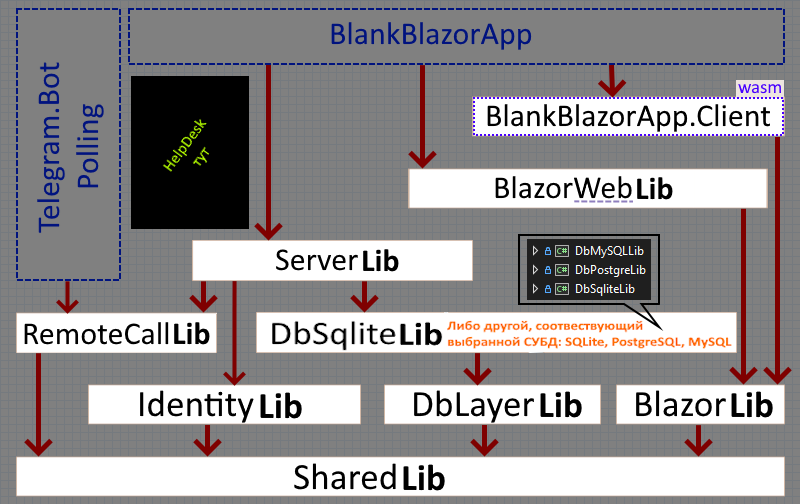

## Blazor NET.8 + TelegramBot

###### + развитие решения в отдельной ветке [constructor](https://github.com/badhitman/DesignerApp/tree/constructor)

- Заготовка **Blazor NET.8**[^4] + **TelegramBot**[^5]: подойдёт как стартовый кейс web решения с поддержкой **Telegram бота**.

- База данных (по умолчанию) [SQLite](https://github.com/badhitman/DesignerApp/tree/main/DBContextLibs#sqlite-установлен-по-умолчанию): миграции отсутствуют, поскольку изначально не понятно какая в итоге СУБД будет выбрана[^10]. Для переключения с **SQLite** на [PostgreSQL](https://github.com/badhitman/DesignerApp/tree/main/DBContextLibs#postgresql) или [MySQL](https://github.com/badhitman/DesignerApp/tree/main/DBContextLibs#mysql): потребуется отредактировать зависимости проектов[^6]. После того как определились с используемой СУБД (*или оставили как есть*: **SQLIte**) - можно использовать миграции [^10]. При каждом изменении схемы БД старая (текущая) база удаляется вручную (СУБД по умолчанию: SqLite) и создаётся [заново двумя командами](https://github.com/badhitman/DesignerApp/blob/main/DBContextLibs/DbSqliteLib/migrations.md). Чистая БД (после пересоздания) [заполняется DEMO данными](https://github.com/badhitman/DesignerApp/blob/a73c30fd2a44fcebaf66d3a58f16aa46e113947a/ServerLib/Services/ConstructorService.cs#L634) благодаря [символам условной компиляции](https://github.com/badhitman/DesignerApp/blob/constructor/ServerLib/ServerLib.csproj#L11). После выхода в релиз 'включатся' и миграции по всем СУБД.

- Связь между службами реализована через RabbitMQ[^1] в режиме `запрос-ответ`: при отправке сообщения в очередь, отправитель дожидается ответ (в границах таймаута) и возвращает результат вызывающему. При использовании вызова такой команды удалённого сервиса проходит так, как если бы это был обычный `await` запрос к базе данных или rest/api.

- Установлен/используется пакет [MudBlazor 7](https://github.com/MudBlazor/MudBlazor/)

> [!IMPORTANT]
> В принципе служба *TelegramBot* могла бы использовать прямой доступ к сервисам как это делает `BlazorWebApp` (достаточно установить зависимость от `ServerLib`), тогда `RemoteCallLib` становится бесполезным и его можно даже удалить (+ заменить зависимости сервисов на серверные). Но в данной реализации *Telegram* бот не связан с серверной инфраструктурой (нет доступа ни к БД сервера ни даже к его DI сервисам), а только отправляет запросы в RabbitMQ и получает ответы в виде `public class TResponseModel<TResponse> : ResponseBaseModel`, который поддерживает наличие статусных сообщений.

Зависимости решения (между проектами). Службы **Telegram.Bot.Polling** и **BlazorWebApp** связаны только двумя общими библиотеками `RemoteCallLib`+`SharedLib`:


### Службы:
#### 1. Telegram.Bot.Polling
- В оригинальном исполнении `Worker Service`[^5].
- Ответы на входящие Telegram сообщения обрабатывает реализация интерфейса `ITelegramDialogService`[^7]. Пользователям можно индивидуально устанавливать имя автоответчика[^2]. Это касается как простых текстовых `Message`, так и `CallbackQuery`.
- Через RabbitMQ служба получает команды от внешних систем, выполняет их, а результат возвращает ответом отправителю (*например команда*: отправка сообщения Telegram клиенту от имени бота)[^1].

#### 2. WEB: BlazorWebApp
- Рендеринг: `InteractiveServerRenderMode(prerender: false)`
- Авторизация типовая `Microsoft.AspNetCore.Identity`.
- В Frontend добавлен базовый функционал для работы с Пользователями, Ролями, Claims и Telegram[^4]. 
- Служба равно как и **Telegram.Bot.Polling** использует RabbitMQ для того что бы обслуживать команды, на которые она зарегистрировала свои обработчики[^1].
 
 ### Настройка
 - Перед запуском служб Blazor[^4] и Telegram бота[^5] потребуются конфиги **MQ**, **Email** (отправка писем **SMTP**. в. т.ч. для **Identity**) и **TelegramBot** токен.
- Помимо стандартных настроек **appsettings.json** потребуется отдельная папка где будут храниться приватные данные: логины и пароли к внешним системам. В обоих службах поиск/чтение секретов происходит подобным образом:
```C#
// Secrets
string secretPath = Path.Combine("..", "secrets");
for (int i = 0; i < 5 && !Directory.Exists(secretPath); i++)
  secretPath = Path.Combine("..", secretPath);
if (Directory.Exists(secretPath))
  foreach (string secret in Directory.GetFiles(secretPath, $"*.json"))
    configHost.AddJsonFile(Path.GetFullPath(secret), optional: true, reloadOnChange: true);
else
  logger.Warn("Секреты не найдены");
```
Приложение ищет папку с именем `secret` на уровне выше текущей директории, а если не находит нужной папки, то пытается искать её ещё выше и выше в иерархии папок пути до исполняемого файла. На этапе разработки эти файлы могут лежать например тут: C:\Users\ _ИмяПользователя_ \source\repos\secrets или выше в иерархии папок.

В папке секретов `secrets` предполагается наличие следующих настроек (одним *.json файлом или разными):

- RabbitMQ подключение потребуется для обоих служб (**Telegram.Bot.Polling** и **BlazorWebApp**):
```json
{
  "RabbitMQConfig": {
    "UserName": "ваш_логин_от_rabbitmq",
    "Password": "ваш_пароль_от_rabbitmq",
    "VirtualHost": "/"
  }
}
```

- Email (SMTP) потребуется только для службы **BlazorWebApp** (*В том числе для отправки уведомлений подсистемой авторизации* `Microsoft.AspNetCore.Identity`):
```json
{
  "SmtpConfig": {
    "Email": "ваш-email@домен",
    "Login": "логин-для-smtp",
    "Password": "ваш-пароль-для-smtp",
    "Host": "smtp-адрес-хоста",
    "Port": 465
  }
}
```
Если отправка Email происходит иначе чем обычный SMTP, тогда следует реализовать `IMailProviderService` под условия и предусмотреть соответствующие настройки.

- Токен **TelegramBot** нужен только для соответствующей службы `Telegram.Bot.Polling`:
```json
{
  "BotConfiguration": {
    "BotToken": "ваш-токен-для-бота"
  }
}
```
Создать бота и получить свой токен можно у [@BotFather](https://t.me/BotFather)

### Роль Admin (полные права) можно назначить через *.json конфигурацию
У службы `BlazorWebApp` можно настроить Email адреса клиентов таким образом, что бы закрепить за ними любые произвольные роли. Это полезно, для первого старта приложения: администратор прописывает свой Email под которым он будет авторизовываться с необходимой ему ролью `admin`, тогда при каждом входе будут проверяться наличие требуемой роли у пользователя. Если необходимых ролей не окажется в системе, то они будут автоматически созданы. Клиент обязательно получит роли, которые ему были прописаны в конфигурации. Пример настроек:
```json
{
  "UserManage": {
    "UpdatesUsersRoles": [
      {
        "EmailUser": "ваш_email@сайт.ru",
        "SetRoles": [ "admin" ]
      },
      {
        "EmailUser": "другой_email@домен.com",
        "SetRoles": [ "manager" ]
      }
    ]
  }
}
```
прописать можно любые роли любым клиентам. после этого им нужно залогиниться - нужные роли обязательно окажутся у клиента. после того как требуемые роли назначены - эти настройки рекомендуется удалить т.к. наличие таких параметров пользователя делает невозможными попытки лишить этих ролей в связи с тем что они будут проверяться и выдаваться при каждом входе клиента.

[^1]: Подробнее про реализацию MQ транспорта можно узнать [тут](https://github.com/badhitman/DesignerApp/tree/main/RemoteCallLib).

[^2]: Имя обработчика ответов храниться в [контексте пользователя](https://github.com/badhitman/DesignerApp/blob/main/SharedLib/Models/TelegramUserBaseModelDb.cs#L45). Подробнее [тут](https://github.com/badhitman/DesignerApp/tree/main/Telegram.Bot.Polling#telegrambot-%D0%B4%D0%B8%D0%B0%D0%BB%D0%BE%D0%B3%D0%B8)

[^4]: Стандартная ASP служба [Blazor WebApp](https://github.com/badhitman/DesignerApp/tree/main/BlankBlazorApp/BlankBlazorApp). За основу взята [эта работа](https://github.com/dotnet/blazor-samples/tree/175634ec31942b181f211008e8841c26e91f33e5/8.0/BlazorWebAssemblyStandaloneWithIdentity).

[^5]: WorkerService служба [Telegram.Bot.Polling](https://github.com/badhitman/DesignerApp/tree/main/Telegram.Bot.Polling) сделана на основе [Telegram.Bot.Examples.Polling](https://github.com/TelegramBots/Telegram.Bot.Examples/tree/d7dd05e12ae97c5949804b465a8a87e3f894c3f2/Telegram.Bot.Examples.Polling).

[^6]: Про переключение контекста между разными СУБД можно узнать [тут](https://github.com/badhitman/DesignerApp/tree/main/DBContextLibs).

[^7]: Свой обработчик ответа на входящее сообщение Telegram реализуется через [интерфейс](https://github.com/badhitman/DesignerApp/blob/main/SharedLib/IServices/ITelegramDialogService.cs) и [регистрации его в **Program.cs**](https://github.com/badhitman/DesignerApp/blob/main/Telegram.Bot.Polling/Program.cs#L84) службы **TelegramBot**.

[^8]: Служба Telegram бота для каждого входящего сообщения [проверяет статус пользователя через вызов удалённой команды](https://github.com/badhitman/DesignerApp/blob/main/Telegram.Bot.Polling/Services/UpdateHandler.cs#L53), которую в данном случае обрабатывает Web сервер Blzaor.

[^9]: [Бот ищет по имени нужного обработчика. Если не находит, то использует базовый](https://github.com/badhitman/DesignerApp/blob/main/Telegram.Bot.Polling/Services/UpdateHandler.cs#L131).

[^10]: Если SQLite подходит, то можно сразу формировать миграции для контекстов: `IdentityAppDbContext` (отдельный контекст для **Microsoft.AspNetCore.Identity**) и `MainDbAppContext`.